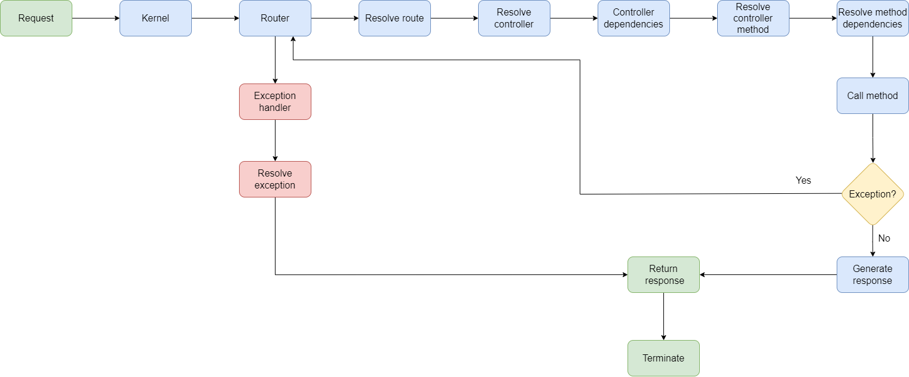

# Documentation

## Working process

1. Server receives request
2. The application creates `Kernel` object who was passed the dependency container in advance
3. The `Kernel` resolve the controller with router
4. Controller's method is called
5. The process goes through the middleware stack
6. If exception is thrown,the `DatabaseTransactionMiddleware` rollbacks all queries and the `ExceptionHandler` middleware catches it and returns the response
7. If no exception is thrown, the `DatabaseTransactionMiddleware` commits all queries and response is returned to the `Kernel`
8. The `Kernel` emits the response to the user

## Features
- Dependency container injection
- Service providers
- Routing
- Middlewares
- Eventing
- Collection
- Database wrapper over PDO
- Templating(Twig)
- REST API
- Console commands
- Migrations
- Dockerized
